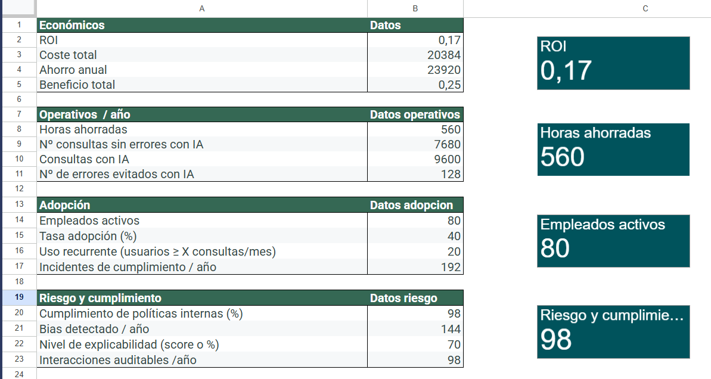

# KPI-s Model

## Impact of Implementing AI Automation in a 200+ Employee Company
This project analyzes the economic, operational, adoption, and compliance impact derived from implementing an Artificial Intelligence system for internal support and process automation. It includes KPI calculations, a data model, Power BI visualizations, and an executive business-oriented narrative.

##  📊 Dashboard Preview

KPIs

Data

RAW DATA

## 📘 Project Objectives
Measure direct economic impact: savings, efficiency, and ROI.

Evaluate the operational improvements generated by AI.

Analyze internal adoption and real usage by employees.

Monitor risks, compliance, and system quality.

Build a professional dashboard in Google Looker Studio for executive reporting.

## KPI Calculation

### 1. Economic KPIs

- Savings from avoided errors:
- Savings from eliminated tools:
- Savings from efficiency (time saved):
- Total benefit:
- Total cost:
- ROI:

### 2. Operational KPIs

- AI‑resolved queries per month:
- Hours saved per month:
- Automated processes: 50%
- Average handling time per query: 5 min

### 3. Adoption KPIs

- Active employees: 200
- Adoption rate: 40%
- Queries per employee per month: 20

### 4. Risk & Compliance KPIs

- Auditable interactions: 95%
- Compliance incidents: 1 per quarter
- Detected biases: 2 per month
- Explainability: 70%
- Traceability: 85%

### 🗂️ Repository Structure

The project currently contains three main components:

1. Data/

Folder containing the dataset used for KPI calculations and dashboard modeling.
This is the source for all economic, operational, adoption, and compliance metrics.

2. Screenshots/

Folder with all dashboard and data‑model images.

Used inside the README to visually document:
- Initial KPIs
- Raw data sample
- Final processed dataset

3. README.md

The main documentation file (the one you are editing right now).

Contains:
- Project description
- Objectives
- KPI definitions
- Dashboard preview images
- Executive narrative

## 📌 Conclusions

The implementation of AI in the company generates:

- Significant annual savings
- ROI of 1.17, justifying the investment
- Reduced operational workload, with hours saved per month
- Solid adoption, with 80 active employees
- Controlled risks, with high traceability and auditability

--

### COMING SOON

### Dashboard in Google Looker Studio

The report includes the following views:

Executive View:
   
- Total benefit
- Annual savings
- Active AI users
- ROI

Economic View:

- Efficiency savings
- Error‑related savings
- Tool‑related savings
- Cost waterfall

Operational View:

- AI‑resolved queries
- Hours saved
- Average handling time
- Adoption View
- Active user evolution

Adoption rate:

- Recurring usage
- Risk & Compliance View
- Detected biases
- Incidents
- Explainability level
- Auditable logs

--

# CASTELLANO

# Modelo-KPIs 

## Impacto de la Implementación de automatización de IA en una Empresa de 200+ Empleados

Este proyecto analiza el impacto económico, operativo, de adopción y de cumplimiento derivado de la implantación de un sistema de Inteligencia Artificial para soporte interno y automatización de procesos. Incluye cálculos de KPI, modelo de datos, visualizaciones en Power BI y una narrativa ejecutiva orientada a negocio.

## 📊 Visualización previa

KPIs

Datos en bruto

Datos

 ## 📘 Objetivos del proyecto
-------------------------
- Medir el impacto económico directo: ahorro, eficiencia y ROI.
- Evaluar la mejora operativa generada por la IA.
- Analizar la adopción interna y el uso real por parte de los empleados.
- Monitorizar riesgos, cumplimiento y calidad del sistema.
- Construir un dashboard profesional en Locker Studio Google para reporting ejecutivo.

## Cálculo de KPI 
-----------------

### 1. KPI Económicos
--------------------
- Ahorro por errores evitados:
- Ahorro por herramientas eliminadas:
- Ahorro por eficiencia (tiempo ahorrado):
- Beneficio total:
- Coste total:
- ROI:

### 2. KPI Operativos
--------------------
- Consultas resueltas/mes con IA:
- Horas ahorradas/mes: 
- Procesos automatizados: 50 %
- Tiempo medio por consulta: 5 min

### 3. KPI de Adopción 
---------------------
- Empleados activos: 200
- Tasa de adopción: 40 %
- Consultas por empleado/mes: 20

### 4. KPI de Riesgo y Cumplimiento 
-----------------------------------
- Interacciones auditables: 95 %
- Incidentes de cumplimiento: 1 / trimestre
- Sesgos detectados: 2 / mes
- Explicabilidad: 70 %
- Trazabilidad: 85 %

## 🗂️ Estructura del repositorio
-----------------------------

## 1. /Data/

Carpeta que contiene los datos del modelo.
Es el origen de datos para los KPIs, cálculos y visualizaciones.

## 2. /Screenshots/

Carpeta con capturas del dashboard y del proceso.

Contiene imágenes como:
- KPIs iniciales.png
- Muestra en bruto.png
- Datos finales.png

Se usan en el README para documentar el proyecto.

## 3. README.md

Documento principal del repositorio.

Incluye:
- Descripción del proyecto
- Objetivos
- KPIs económicos, operativos, de adopción y compliance
- Imágenes del dashboard
- Narrativa ejecutiva

## 📌 Conclusiones
---------------
La implementación de IA en la empresa genera:

- Ahorros anuales significativos 
- ROI del 1.17, justificando la inversión.
- Reducción de carga operativa, con  horas ahorradas al mes.
- Adopción sólida, con 80 empleados activos.
- Riesgos controlados, con alta trazabilidad y auditabilidad.

  

### PROXIMAMENTE

### Dashboard en Locker Studio Google
------------------------
El informe incluye las siguientes vistas:

Vista ejecutiva

   - Beneficio total
   - Ahorro anual
   - Empleados activos con IA
   - ROI

Vista económica

   - Ahorro por eficiencia
   - Ahorro por errores
   - Ahorro por herramientas
   - Cascada de costes

Vista operativa

   - Consultas resueltas con IA
   - Horas ahorradas
   - Tiempo medio por consulta

Vista de adopción

   - Evolución de usuarios activos
   - Tasa de adopción
   - Uso recurrente

Vista de riesgo y cumplimiento
   - Sesgos detectados
   - Incidentes
   - Nivel de explicabilidad
   - Logs auditables

